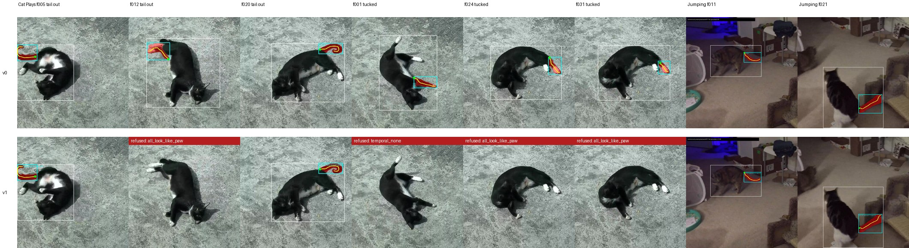

# Whether: teaching a text-grounded tail detector to say "no"

**Ava Kim** — cat-pose-benchmark, technical note 02, v0.1, 14 September 2026

Repository: https://github.com/in-c0/cat-pose-benchmark · Follows note 01, *Where, not whether* · Licence of this note: CC-BY-4.0

## Abstract

Note 01 found that asking Grounding DINO for `"cat. tail."` locates a cat's tail well when the tail is extended and draws a paw when it is tucked, because the detector has no way to answer "no tail visible" once it has a cat. This note tries the three cheapest fixes: give the detector more pixels by detecting on a crop of the cat (zoom), ask a second model whether each candidate crop is a tail or a paw (crop check, SigLIP), and require the chosen box to move smoothly across frames with an explicit "no tail" state (temporal, Viterbi). On the same 57 frames, scored against note 01's frame-by-frame reading as a proxy, zoom made things slightly worse, and the crop check and the temporal pass each did almost nothing alone. Together they raise precision from 0.52 to 0.95 at a recall of 0.72: 18 of 19 accepted frames are on the tail, every tucked frame of *Cat Plays* is now a refusal, and every accepted frame of the jumping clip is right. The cost is seven true tails refused, three by the crop check and four by the temporal pass. The parameters were chosen by a grid on these same frames; the grid has a broad plateau, but this is not a held-out result and is offered as the next thing for the repository's human-verdict protocol to test, not as a finding about cats in general.

## 1. The problem carried over from note 01

Three tail methods were compared in note 01 on 57 frames from two Creative Commons clips: SAM2 mask propagation, a keypoint-anchored geometric method, and Grounding DINO prompted with `"cat. tail."` followed by SAM2 on the returned box. The grounded method was the first that behaved as if it knew what a tail is, right on 14 of 15 accepted frames on the jumping clip. On *Cat Plays*, where the cat lies on its back with the tail under it for two thirds of the clip, it accepted all 33 frames and was right on 11; the other 22 were a white paw or the chest.

Note 01 also recorded two things that did not help: a keypoint veto (refuse masks containing a paw keypoint) removed six true tails and kept five paws because the pose model is wrong on the same frames, and the anchored method's geometry rules applied to the grounded box raised precision while halving recall without separating the classes. The conclusion was that the detector decides *where* well and *whether* badly.

This note is about *whether*.

## 2. Three additions

All three live in `detail/grounded_tail_v1.py`, each behind a switch, on top of the note 01 method unchanged.

**Zoom.** Detect the cat on the full frame, then run `"cat. tail."` on a 25 %-padded crop of the cat box and map the boxes back. The detector resizes its input to about 800 px on the short side, so a 30 px tail in a 1280 px frame is 30 px in a 400 px crop: the part gets pixels.

**Crop check.** Each candidate tail box, padded 30 %, is scored by SigLIP (`google/siglip-base-patch16-224`, Apache-2.0) against six texts: a cat's tail, paw, leg, face, belly, and carpet or floor. SigLIP gives an independent sigmoid per text. A candidate is refused when its paw score is at least 0.10 and above its tail score. The point of using a different model is that it should fail differently from the detector; the keypoint veto in note 01 failed because RTMPose and Grounding DINO fail on the same upside-down frames.

**Temporal.** Up to two candidates per frame that survive the crop check, plus a "no tail" state, go through a Viterbi pass over the frame sequence. The emission of a candidate is its detector score; "no tail" emits 0.20. Moving between two boxes costs 0.5 times their centre displacement measured in cat-box diagonals; entering or leaving "no tail" costs 0.20. The best path gives one answer per frame, including "none". The idea is that a real tail moves smoothly between frames a quarter of a second apart and a paw picked by default does not.

## 3. Material and scoring

Same two clips, same 57 frames, same body keypoints as note 01. Grounding DINO tiny, SAM2 hiera-tiny.

No human verdicts exist yet under the repository's protocol, so this note uses note 01's frame-by-frame reading as a proxy: a v1 frame is *right* if note 01 judged the v0 box on that frame to be on the tail and the v1 box overlaps it at IoU ≥ 0.3; *wrong* if v1 accepted anything else; *missed* if note 01 was right there and v1 refused. There are 48 frames with a cat box and 25 that note 01 judged right. A weakness of the proxy: a v1 frame that found a tail note 01 missed would count as wrong. On this set that cannot happen, because v0 refused no frame that had a cat, but it will on a harder clip.

## 4. Results

**Table 1.** Ablation over both clips, proxy scoring. "Chosen" is the configuration shipped as `tail_grounded_v1`.

| configuration | accepted | right | wrong | missed | precision | recall |
|---|---|---|---|---|---|---|
| none (= v0, note 01) | 48 | 25 | 23 | 0 | 0.52 | 1.00 |
| zoom | 50 | 24 | 26 | 0 | 0.48 | 1.00 |
| crop check | 42 | 21 | 21 | 1 | 0.50 | 0.95 |
| temporal | 45 | 22 | 23 | 2 | 0.49 | 0.92 |
| zoom + crop check | 43 | 22 | 21 | 1 | 0.51 | 0.96 |
| zoom + crop check + temporal | 34 | 18 | 16 | 7 | 0.53 | 0.72 |
| crop check + temporal, first parameters | 29 | 20 | 9 | 4 | 0.69 | 0.83 |
| **crop check + temporal, chosen** | **19** | **18** | **1** | **7** | **0.95** | **0.72** |

**Table 2.** The chosen configuration per clip.

| clip | accepted | right | wrong | missed | refused as paw | refused by temporal |
|---|---|---|---|---|---|---|
| *Cat Plays* | 6 | 5 | 1 (f006, a paw) | 6 (f000, 004, 009, 010, 011, 012) | 15 | 12 |
| *Jumping* | 13 | 13 | 0 | 1 (f005) | 0 | 2 |



**Figure 1.** v0 (top) and v1 (bottom) on eight frames. Left to right: three *Cat Plays* frames with the tail out, three with it tucked, two jumping-clip frames. Cyan is the detector's tail box, red the SAM2 mask, yellow the curve. A red banner is a v1 refusal and names the reason. v1 keeps f005 and f020, refuses f012 (a true tail, on the crop check), and refuses all three tucked frames that v0 drew a paw on.

## 5. What the ablation says

**Zoom hurt.** The crop-pass detector returns lower scores and different boxes. The candidates on the tucked frames were no better and some right ones were worse. It is off by default and kept as a switch.

**The crop check alone did nothing.** It refuses the paw the detector picked first. The detector's second candidate is another paw, and on that smaller crop SigLIP's scores are near zero for every text, so the rule has nothing to act on and the candidate passes. Refusing one wrong answer exposes the next.

**The temporal pass alone did little.** The wrong candidate on consecutive tucked frames is usually the same paw in the same place, which is as smooth as a tail.

**Together they work.** The crop check removes the confident paws. What is left on the tucked frames is low-scoring and inconsistent from frame to frame, and the temporal pass prefers "no tail" to a low, jumping candidate. On *Cat Plays* every tucked frame is now a refusal, and the one wrong acceptance (f006) is a paw that the crop check scored near zero for everything and that happened to sit near the previous frame's true tail.

The seven refused true tails split by cause. Three are the crop check: f009, f011 and f012, where SigLIP calls the crop a paw at 0.73, 0.30 and 0.29. Two of those are a tail with a white tip lying next to a white paw. Four are the temporal pass: f000, f004 and f010 on *Cat Plays* and f005 on the jumping clip, all isolated frames with no smooth neighbour because the tail is only briefly out or the sequence is just starting.

## 6. Parameters, and the honest caveat

The chosen thresholds (paw 0.10, two candidates, none-emission 0.20, move weight 0.5, switch cost 0.20) came from an offline grid over the saved candidates: paw threshold 0.05/0.10/0.20, one to three candidates, none-emission 0.10–0.25, move weight 0.3–1.0, switch cost 0.05–0.20. The grid's top is a plateau: a dozen settings give 18 right / 1 wrong / 7 missed or 17 / 1 / 8, and the strictest give 16 / 0 / 9. The chosen point is in the middle of the plateau rather than at its edge. That is the most that can be said. The parameters were fitted on the frames they are reported on, and the right way to read Table 1 is as evidence that the combination is the thing to test next, not as its test.

## 7. What this changes

For the benchmark: the grounded method can now refuse, which means the "not visible" verdict in the review protocol has something to be compared against. A reviewer marking a refused frame `not_visible` agrees with the method; marking it `wrong` says the method missed a visible tail. That distinction was meaningless for v0, which never refused.

For the next steps listed in note 01: items 4 to 7 (a larger grounding model, Grounding DINO as the cat detector for the body run, grounded re-seeding of SAM2 propagation, SAM 3) now have a baseline that is precise enough to measure a coverage improvement against. Recall, not precision, is the number to move.

## 8. Reproducing

At repository commit `e9b1e1d` or later, with the dependencies of note 01 plus `transformers` for SigLIP:

```bash
python -m review.run_tail_grounded_v1 --device cuda            # chosen configuration
python -m review.run_tail_grounded_v1 --device cuda --no-temporal --tag v1_check
python -m review.run_tail_grounded_v1 --device cuda --zoom --tag v1_zoom_check_temporal
python -m review.sheets --output-dir review/work/sheets
python paper/02-whether/make_figures.py
```

The per-method report with the full ablation is `detail/reports/grounded-tail-v1.md`. The review template now carries a `tail_curve_grounded_v1` part.

## Acknowledgements

As for note 01: experiments, code and first draft produced with Claude Code (Anthropic) under the author's direction; the author reviewed the sheets that produced note 01's reading, which this note uses as its proxy truth.

## References

- Zhai, X. et al. *Sigmoid Loss for Language Image Pre-Training.* ICCV 2023. Model `google/siglip-base-patch16-224`, Apache-2.0.
- Liu, S. et al. *Grounding DINO.* ECCV 2024. `IDEA-Research/grounding-dino-tiny`, Apache-2.0.
- Ravi, N. et al. *SAM 2.* 2024. `facebook/sam2.1-hiera-tiny`, Apache-2.0.
- Viterbi, A. *Error bounds for convolutional codes and an asymptotically optimum decoding algorithm.* IEEE Trans. Inf. Theory, 1967.
- Kim, A. *Where, not whether: finding a cat's tail in ordinary video with a text-grounded detector.* cat-pose-benchmark technical note 01, 2026.
