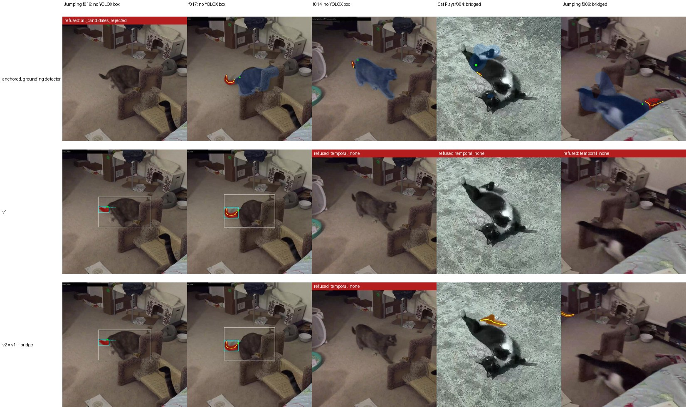

# Coverage: a better cat detector, a bridge across short gaps, and two things that did not help

**Ava Kim** — cat-pose-benchmark, technical note 03, v0.1, 14 September 2026

Repository: https://github.com/in-c0/cat-pose-benchmark · Follows notes 01 and 02 · Licence of this note: CC-BY-4.0

## Abstract

Note 02 made the text-grounded tail method precise (0.95 on a proxy) by letting it refuse, at the cost of recall (0.72). This note tries the four coverage items that followed in the plan: larger models, Grounding DINO as the cat detector for the whole pipeline, bridging short gaps in the grounded result with SAM2 video propagation, and SAM 3. Two of the four helped. Replacing YOLOX-m with Grounding DINO as the cat detector raised frames-with-a-cat from 43 to 55 of 57 and, downstream, took the keypoint-anchored method on the jumping clip from 4 right of 6 accepted to about 9 of 13. Bridging recovered two true tails at a reach of one frame with nothing wrong, and five with two wrong at a reach of two; it ships at one. Larger models did not help as drop-ins: the base Grounding DINO scores differently and starves the temporal pass, and the larger SigLIP calls more tails paws. SAM 3 is gated and needs the owner's account. Along the way a label-parsing bug was found and fixed: the detector sometimes labels the whole animal `cat tail`, and four frames had no cat because of it. Final proxy numbers, both clips: precision 0.95, recall 0.76 (v2), against 0.50 / 1.00 for the method in note 01. The remaining misses are isolated true tails the temporal pass refuses and white-tipped tails next to white paws the crop check refuses; those are the note 02 trade-off, and this note argues they need labels, not another rule.

## 1. Starting point

Note 02 left the grounded method (`tail_grounded_v1`) at 18 right, 1 wrong, 7 missed on the 25 frames note 01 had judged right, with a 57-frame set in which 14 frames had no cat detection at all. Recall, not precision, was the number to move. The plan had four coverage items; each is a section below, in the order they were tried, with the negative results kept.

Scoring is the proxy of note 02: a frame is right when note 01 judged the v0 box on it to be on the tail and the new box overlaps it at IoU ≥ 0.3, wrong when anything else is accepted, missed when a note-01-right frame is refused. Eyeball reads are marked as such.

## 2. A bug, first

`pick_cat_box` accepted only detections labelled exactly `cat`. Grounding DINO sometimes merges the two prompt phrases and labels the whole animal `cat tail`. On four jumping-clip frames (f002, 003, 004, 018) that merged box was the only cat, so v0 and v1 reported `no_cat` there. The fix accepts any label containing the word `cat`. After it, v0 accepts 17 jumping frames instead of 15, and v1's proxy score moves from 18 / 1 / 7 to 17 / 1 / 8, because the temporal path changes around the new frames. The published numbers in notes 01 and 02 predate the fix and are left as they are; everything below uses the fixed code.

## 3. Larger models (item 4)

**Table 1.** Model swaps on v1, proxy scoring, both clips.

| change | accepted | right | wrong | missed | precision | recall |
|---|---|---|---|---|---|---|
| v1 as shipped (Grounding DINO tiny, SigLIP base) | 19 | 18 | 1 | 7 | 0.95 | 0.72 |
| Grounding DINO base instead of tiny | 6 | 3 | 3 | 22 | 0.50 | 0.12 |
| SigLIP so400m instead of base | 25 | 17 | 8 | 8 | 0.68 | 0.68 |

The base detector is not worse at finding tails; it scores them differently. The same tail box comes out at 0.38 where tiny gives 0.58, and it returns fewer candidates. The temporal pass has a "no tail" emission of 0.20 calibrated to tiny's scale, so with base it prefers "no tail" almost everywhere. Making base work would mean re-fitting the temporal parameters on the same 57 frames, which note 02 already flagged as the weak point of the method; not done. The larger SigLIP is more confident across the board and refuses more true tails as paws. Both switches remain in the code.

## 4. Grounding DINO as the cat detector (item 5)

The body run (`review/run_body.py`) supplies every method with a cat box and RTMPose keypoints. It used YOLOX-m. It now prompts Grounding DINO with `"cat."` and passes the box to RTMPose unchanged.

**Table 2.** Frames with a cat detection.

| clip | YOLOX-m | Grounding DINO |
|---|---|---|
| *Cat Plays* (33 frames) | 26 | 33 |
| *Jumping* (24 frames) | 17 | 22 |

The two jumping frames still missed are the motion-blurred opening. Downstream, by eyeball: the anchored method on the jumping clip goes from 6 accepted / 4 right to 13 accepted / about 9 right, with 2 wrong (a strip of back on f010, a blob beside the cat on f012) and 2 stubs; on *Cat Plays* it is unchanged. v1 is unaffected because it runs its own detection and uses the body run only for the cat-box preference on the two-cat clip and for the `tail_root` keypoint that starts the centreline.

This was the cheapest item in the stage and the one with the clearest effect. The detection ceiling that note 01 said capped every method is mostly gone.

## 5. Bridging with SAM2 propagation (item 6)

`detail/tail_bridge.py` takes a v1 result and, for each accepted frame, seeds SAM2's video predictor with that frame's mask and propagates into neighbouring frames that were refused for lack of evidence (`no_cat`, `no_tail_box`, `temporal_none`), up to a reach of one or two frames each way. Frames that v1 refused because every candidate looked like a paw are never filled; saying "no" there was the point of note 02. A propagated mask is accepted if its area stays within 0.4–2.5 times the seed's and the SigLIP check does not call its bounding box a paw.

**Table 3.** What bridging adds, eyeball.

| reach | frames added | right | wrong |
|---|---|---|---|
| 1 | 2 (*Cat Plays* f004, *Jumping* f006) | 2 | 0 |
| 2 | 7 (also f003, f010, f017; *Jumping* f005, f014) | 5 | 2 (f003 is a paw, f017 the hip) |

It ships at reach 1 as `tail_grounded_v2`. Two things are worth recording. The SigLIP check on propagated masks fired on neither wrong frame; its scores were near zero for every text, as they were for the detector's second candidates in note 02. And at 4 fps, propagation drifts from a tail onto a paw within two frames on *Cat Plays*, which is the failure note 01 started from, now with a number on how far it can be trusted.



**Figure 1.** Coverage gains. Rows: the anchored method with the new detector, v1, v2. Columns: three jumping-clip frames where YOLOX-m had no detection and Grounding DINO does, and the two frames bridging adds. A red banner is a refusal and names the reason.

## 6. SAM 3 (item 7)

`facebook/sam3` is gated on the Hub, with manual approval and a non-standard licence. It was not attempted. Access needs the owner's account, and the licence needs reading before the model goes near a repository whose point is to be licence-clean. Recorded as blocked on the owner.

## 7. Where the numbers are

**Table 4.** Both clips, proxy scoring, after the label fix and with the new detector.

| method | accepted | right | wrong | missed | precision | recall |
|---|---|---|---|---|---|---|
| v0, note 01 | 50 | 25 | 25 | 0 | 0.50 | 1.00 |
| v1, note 02 | 18 | 17 | 1 | 8 | 0.94 | 0.68 |
| v2, this note | 20 | 19 | 1 | 6 | 0.95 | 0.76 |

The v0 row counts the two newly detected jumping frames as wrong because note 01 never judged them.

Stage 2 moved recall by two frames and detection coverage by twelve. The six remaining misses are *Cat Plays* f000, f009, f010, f011, f012 and *Jumping* f005: isolated true tails the temporal pass refuses for having no smooth neighbour, and white-tipped tails lying next to a white paw that the crop check calls a paw. Those are not coverage problems. They are the trade-off note 02 made on purpose, and the four items in this note were never going to undo it. What would is a model that has seen labelled cat tails, which is the next stage of the plan and needs the review loop to produce the labels.

## 8. Reproducing

At repository commit after PR #85, with the dependencies of notes 01 and 02:

```bash
python -m review.run_body                              # Grounding DINO detector is now the default
python -m review.run_tail_anchored --device cuda
python -m review.run_tail_grounded --device cuda
python -m review.run_tail_grounded_v1 --device cuda
python -m review.run_tail_grounded_v2 --device cuda    # bridging, reach 1
python -m review.run_tail_grounded_v1 --device cuda --detector IDEA-Research/grounding-dino-base --tag v2_base
python -m review.run_tail_grounded_v1 --device cuda --classifier google/siglip-so400m-patch14-384 --tag v2_so400m
python paper/03-coverage/make_figures.py
```

The per-item report is `detail/reports/grounded-tail-v2.md`. The review template now carries `tail_curve_grounded_v2`.

## Acknowledgements

As for notes 01 and 02.

## References

- Liu, S. et al. *Grounding DINO.* ECCV 2024. `IDEA-Research/grounding-dino-tiny` and `-base`, Apache-2.0.
- Zhai, X. et al. *Sigmoid Loss for Language Image Pre-Training.* ICCV 2023. `google/siglip-base-patch16-224`, `google/siglip-so400m-patch14-384`, Apache-2.0.
- Ravi, N. et al. *SAM 2.* 2024. `facebook/sam2.1-hiera-tiny`, Apache-2.0.
- Ge, Z. et al. *YOLOX.* 2021.
- Kim, A. Technical notes 01 and 02, cat-pose-benchmark, 2026.
