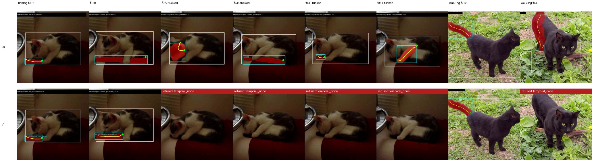
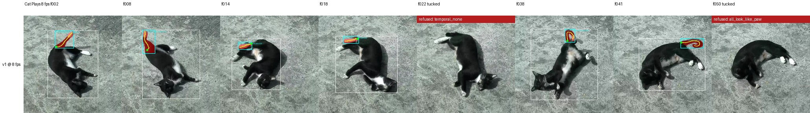

# Held out: two new clips, a sampling rate, and a probe that did not transfer

**Ava Kim** — cat-pose-benchmark, technical note 04, v0.1, 14 September 2026

Repository: https://github.com/in-c0/cat-pose-benchmark · Follows notes 01–03 · Licence of this note: CC-BY-4.0

## Abstract

Notes 01–03 tuned every threshold on the same 57 frames and said so. This note adds two Creative Commons clips after the last threshold was fixed, a black cat walking (38 frames) and a young cat licking its tail on a sofa (52 frames), and runs every method on them untouched. The grounded method with the crop check and temporal pass (v1) accepts 61 frames across the two clips and, by one person's reading, all 61 are on the tail; on the licking clip it refuses the 25 frames where the cat has curled around its tail, on which the plain grounded method draws a face, a paw or the sofa nine times. The keypoint-anchored method, whose thresholds were fitted more tightly, produces nothing on the licking clip. Two further results follow. Resampling the training clip *Cat Plays* at 8 fps instead of 4 takes v1 from 6 accepted frames to 25, about 22 of them right, because a true tail now always has a smooth neighbour for the temporal pass; the tucked stretch stays refused. And the plan's last item, a learned tail component, was tried in its cheapest form: a logistic-regression probe on SigLIP crop embeddings trained on 61 pseudo-labelled tails from the two training clips. Leave-one-clip-out precision is 0.31 and 0.50. It does not transfer between two cats, which is the expected result at that data size and says what training needs before it is worth doing again: more cats, and labels a person has checked.

## 1. Why a held-out set was overdue

Every number in notes 01–03 came from 57 frames of two clips, and the parameters of the crop check, the temporal pass and the anchored rules were chosen by looking at those frames. Note 02 called that its weak point. This note is the check.

Two clips were added to `review/clips.json` after the last commit that touched a threshold, both licence-verified through the Commons API:

| clip | licence | frames at 2 fps | what it is |
|---|---|---|---|
| *Black Cat walking* | CC0-1.0 | 38 | one black cat walking towards and past the camera on grass, tail up throughout, 1080p |
| *Cat licking tail* | CC-BY-SA-3.0 | 52 | one young cat on a sofa; its tail lies along the sofa edge for the first half of the clip and is curled under the cat for the second, 640×480 |

Nothing was changed after seeing them. Scoring is one person's reading of the sheets, as before; the verdict template for both clips is in `review/results/2026-09-14-heldout-v0/`.

## 2. Held-out results

**Table 1.** Every method on the two held-out clips, eyeball.

| clip | method | accepted | on the tail | wrong | tail visible but refused |
|---|---|---|---|---|---|
| walking | v0 grounded | 36 | 36 | 0 | 0 |
| walking | v1 | 34 | 34 | 0 | 2 (f031, f032, temporal pass) |
| walking | v2 = v1 + bridging | 35 | 35 | 0 | 1 |
| walking | anchored | 30 | not read closely | | 7 |
| licking | v0 grounded | 34 | ~25 | ~9 (face, paw, sofa, a leg) | 0 |
| licking | v1 | 27 | 27 | 0 | 0 |
| licking | v2 | 28 | 28 | 0 | 0 |
| licking | anchored | 0 | — | — | 27 |



**Figure 1.** v0 (top) and v1 (bottom) on held-out frames. Left six: the licking clip, two frames with the tail along the sofa and four with it tucked. Right two: the walking clip. v0 draws something on every tucked frame; v1 refuses them. On walking f031 v0 is right and v1 refuses, one of its two misses.

The walking clip is easy for every grounded variant: a black tail held up against grass. The licking clip is where the "whether" machinery from note 02 does its job, and it does it on a cat, a room and a camera it has never seen. The two misses on the walking clip are the temporal pass refusing the last frames before the cat walks out of shot, the same isolated-frame failure note 02 described.

The anchored method does not survive the change of clip. Its rules were fitted to how the training cats' bodies sat in their frames; on the licking clip, where the cat is small and the tail lies along a sofa of similar darkness, every candidate fails one of them.

This is not a claim of precision 1.0 in general. Neither held-out clip has the thing that defeated v1 on *Cat Plays*, a white-tipped tail next to a white paw. It is evidence that the crop check and the temporal pass were not fitted to the training clips' quirks, which is what a held-out set is for.

## 3. The sampling rate

The review set samples at 3–4 fps, chosen so that the SAM2 seed fixtures from the earlier propagation work land on exact frames. The temporal pass was tuned at that rate. Resampling *Cat Plays* at 8 fps (a `-dense` entry in `clips.json`, excluded from review) and running v1 unchanged:

**Table 2.** v1 on *Cat Plays* at two sampling rates, eyeball.

| sampling | frames | accepted | on the tail | tail visible but refused |
|---|---|---|---|---|
| 4 fps | 33 | 6 | 5 | 6 |
| 8 fps | 66 | 25 | ~22 | ~3 |



**Figure 2.** v1 on *Cat Plays* at 8 fps. The first four and the sixth and seventh are frames with the tail out that were refused or absent at 4 fps; the fifth and eighth are tucked frames, still refused.

At 8 fps a true tail always has a neighbour a quarter of the distance away, so the temporal pass stops refusing isolated frames, which was the main recall loss note 02 accepted. The tucked stretch is still refused entirely. This is the cheapest recall gain found in the whole programme, and it is a sampling-rate setting rather than a model change. The review set keeps its rate because the seed fixtures depend on it; any deployment of the method should not.

## 4. The probe

Item 8 of the plan was to train a tail component. Its cheapest form is a probe: keep the detector's proposals, replace the six-sentence zero-shot crop check with a logistic regression on SigLIP image embeddings, trained on the pipeline's own accepted tails. `detail/tail_probe.py` does this. Positives are the 61 tail boxes v1 accepted on the two dense training clips; negatives are the 138 other candidates on those frames. No human label is involved.

With two training clips the only honest evaluation is leave-one-clip-out:

**Table 3.** Probe trained on one clip, tested on the other.

| held-out clip | precision | recall | n |
|---|---|---|---|
| *Cat Plays* dense | 0.31 | 0.16 | 128 |
| *Jumping* dense | 0.50 | 0.72 | 71 |

It does not transfer. A probe trained on one cat's tails does not recognise the other's; the zero-shot check it was meant to replace does better on both. At 61 positives from two animals in two rooms this is the expected outcome, and it is recorded rather than tuned away. The probe file is kept in the repository with its training counts and these numbers inside it, so the next attempt has something to beat, and it is wired into nothing.

What item 8 needs before it is worth doing again is stated plainly: tails from more cats than two, in more rooms than two, and labels a person has checked rather than the pipeline's own output. The review protocol's correction mode and the public call for clips are the path to that data. Until then the zero-shot check stands.

## 5. Where the programme is

Four notes in. The plain grounded method finds an extended tail; the crop check and the temporal pass let it refuse a tucked one; a better cat detector lifts coverage; bridging adds a frame or two; and all of that holds on two clips it never saw. Recall at the review set's frame rate is the remaining weakness, and doubling the rate fixes most of it. The trained component waits on data.

Every "on the tail" count in these notes is still one person's reading of a contact sheet. The templates exist for two review sets, 513 rows and 720 rows. Filling them is what would turn four notes into a result.

## 6. Reproducing

At the repository commit after PR #86:

```bash
python -m review.sample_frames --clip commons-black-cat-walking --clip commons-cat-licking-tail
python -m review.run_body --clip commons-black-cat-walking --clip commons-cat-licking-tail
python -m review.run_tail_grounded --device cuda --clip commons-black-cat-walking --clip commons-cat-licking-tail
python -m review.run_tail_grounded_v1 --device cuda --clip commons-black-cat-walking --clip commons-cat-licking-tail
python -m review.run_tail_grounded_v2 --device cuda --clip commons-black-cat-walking --clip commons-cat-licking-tail
python -m review.sample_frames --clip commons-cat-plays-dense --clip commons-cat-jumping-backwards-dense
python -m review.run_body --clip commons-cat-plays-dense --clip commons-cat-jumping-backwards-dense
python -m review.run_tail_grounded_v1 --device cuda --clip commons-cat-plays-dense --clip commons-cat-jumping-backwards-dense
python -m detail.tail_probe build --clip commons-cat-plays-dense --clip commons-cat-jumping-backwards-dense --output detail/models/tail_probe_v0.json --device cuda
python paper/04-held-out/make_figures.py
```

The per-item report is `detail/reports/held-out-and-probe-v0.md`.

## Acknowledgements

As for notes 01–03.

## References

- Wikimedia Commons, *Black Cat walking.webm* (Dzkouslavia, CC0) and *Cat licking tail.ogv* (Ammoniumnitrate, CC-BY-SA-3.0).
- Zhai, X. et al. *Sigmoid Loss for Language Image Pre-Training.* ICCV 2023.
- Liu, S. et al. *Grounding DINO.* ECCV 2024.
- Ravi, N. et al. *SAM 2.* 2024.
- Kim, A. Technical notes 01–03, cat-pose-benchmark, 2026.
