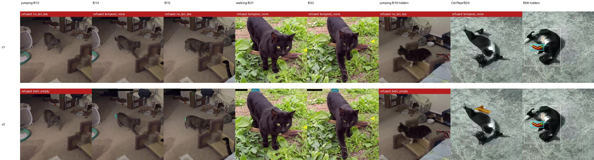
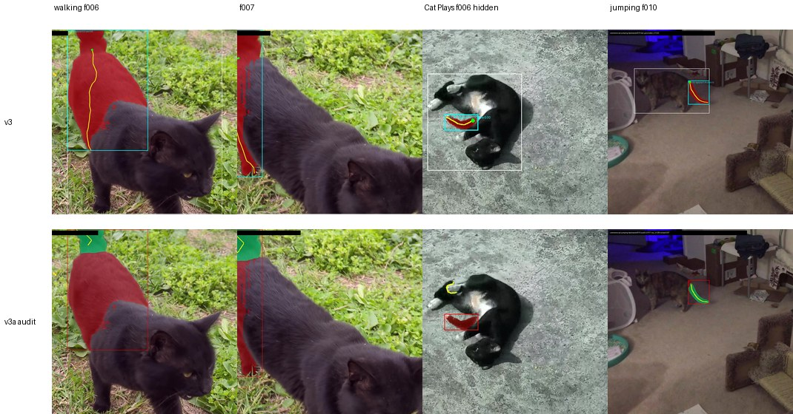
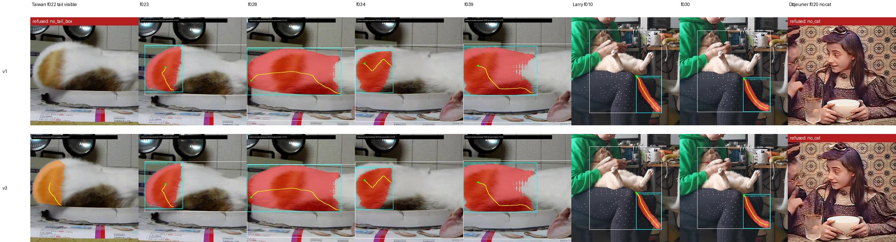

# Frozen truth: ten passes against fixed frame labels, and a prospective holdout that undid one of them

**Ava Kim** — cat-pose-benchmark, technical note 05, v0.2, 20 September 2026 (v0.1 earlier the same day; §6b added)

Repository: https://github.com/in-c0/cat-pose-benchmark · Follows notes 01–04 · Licence of this note: CC-BY-4.0

## Abstract

Notes 01–04 scored every method by one person reading contact sheets after the fact. This note replaces that with a frame truth written down before scoring: for each of 147 development frames, whether a tail is visible, how sure the annotator is that the thing seen is the tail, and a reference box; method judgements are derived from it by a scorer, and every hand override carries a reason. Against that truth, one change survived from a series of twelve back-and-forth passes with a second model acting as reviewer: a two-sided SAM2 bridge that fills a short refusal gap only where the masks propagated from both sides intersect (v3). It takes the grounded method from 75 to 82 true frames at the same two false positives (precision 0.953, recall 0.911). Six other ideas were tried and rejected against the same truth, including one that looked like a gain under the old proxy and is a loss under the truth. An audit that turns the same bridge on the accepted frames (v3a) corrected two more, but the two it corrected turned out to be errors in the truth as well, so it stays a candidate. Then four new clips were chosen by a precommitted metadata-only protocol, annotated before any method ran, and scored once. The bridge gained nothing there, and on one clip the detector read the orange patch on a rolling cat's rump as its tail for 17 consecutive frames, which none of the temporal machinery can touch because it is temporally consistent. Precision on unseen ordinary video is 0.70, not 0.95, and the note says why. A second holdout of eight clips drawn by the same protocol (§6b, added in v0.2) gives the other half of the picture: there the bridge's recall gain does generalise (0.73 → 0.77 at the same precision), and precision is again set by wrong-part assertions, 0.73, of four kinds the development clips never showed.

## 1. Why the proxy had to go

Note 04 ended by saying that every "on the tail" count was one person's reading of a sheet. The first pass of this session showed what that costs. Sampling the four review clips at two to four times the review rate and scoring only the review timestamps looked like a gain of three recall points under the proxy scorer. When the same frames were scored against written-down labels, it was a loss on both axes (73 true, 25 missed, 8 false, against 77/22/2 for the plain method). Denser sampling gives the temporal pass more junk proposals on the frames where the tail is hidden, and the "no tail" state loses more often.

The proxy had also been wrong about *Cat Plays* three times over. The visible set for that clip was revised in passes 1 and 3 and again when the truth was built, each time by going back to the raw frames. The rule that settled it is in `review/truth/clips.md`: the tuxedo cat's tail is all black; a black limb that ends in a white paw is a leg. Under that rule the tail is out on six of 33 frames, not eleven.

## 2. The frame truth

`review/truth/frames.csv` has one row per review frame with `tail_visibility` (visible, partial, not_visible, uncertain), `tail_identity_confidence` (high, medium, low — how sure the annotator is that the appendage judged is the tail, which *Cat Plays* showed is a separate question from whether an appendage is seen), a condition, a note, and a `reference_box` the annotator confirmed lies on the tail. Where a second cat's tail is discernible it is recorded too (`alt_*` columns; only the jumping clip has two cats). Method judgements are a second layer, derived by `review/score_truth.py`: a method is correct on a frame when it asserts a tail and its box overlaps a reference at IoU ≥ 0.3, or is no larger than the reference with 80 % of itself inside it. Hand overrides for the cases the automatic match gets wrong live in `review/truth/methods/overrides.csv`, each with a reason.

The primary metric counts a frame as positive when a tail is visible or partial *and* the identity confidence is high or medium. Frames where the only visible tail is low-confidence, or that are uncertain, form an ambiguous stratum that is excluded from precision and recall and reported on its own. On the development clips that stratum is 13 frames: four motion-blurred frames of the jumping clip and nine frames of the licking clip where the cat has curled around something under its chin that is probably its tail and cannot be shown to be. Those nine were re-reviewed with a second of raw video either side, at 8 fps, before the rule was adopted; the context is consistent with the tail being licked and does not resolve it.

The truth went through three revisions during the session, and each is recorded in `review/truth/README.md` with its reason. Two matter. Revision 1.1 added the second cat. Revision 1.2 replaced the reference boxes on two frames of the walking clip after the audit in §5 showed that the boxes the truth had taken from a detector covered the whole cat with the tail tip at the top edge; at the same time the scorer's containment rule became one-way, so that a box which merely contains a tail no longer matches. That is method output reaching into the truth, checked by eye, and it is stated as such.

The reviewer is a model. The header of every truth file says so, with the reviewer id, and a human pass is filed as an owner item. Until it happens, nothing in this note is a human verdict.

## 3. What survived: the two-sided bridge

Note 03 added a one-sided bridge: a refused frame next to an accepted one gets the accepted frame's mask propagated across by SAM2, at reach 1, with an area gate. Pass 6 asked what happens when a refusal gap has an accepted frame on both sides. `detail/tail_bridge_bidir.py` propagates the left seed forward and the right seed backward and writes four result sets — left, right, union, intersection — so that each could be scored before choosing. Only two such gaps of length ≤ 3 exist on the development clips: walking f031–f032, where the cat's tail tip shows above its back and the detector loses it, and jumping f013–f015, where the tabby's tail is small against a busy background. On both the two propagated masks agree (IoU 0.82–0.99). A third gap, jumping f018–f019, is hidden; there the two masks do not overlap at all (IoU 0.00), the right-side mask being three times its seed. The intersection variant refuses that frame because the intersection is empty; the other three accept it. No threshold is involved.

**v3** is v1 plus the reach-1 bridge plus the two-sided intersection bridge for gaps of at most three frames. Against truth 1.3:

**Table 1.** Development clips, primary stratum (134 frames), truth 1.3.

| method | TP | wrong on a visible frame | missed | wrong on a hidden frame | correct refusal | precision | recall |
|---|---|---|---|---|---|---|---|
| v1 (note 02) | 75 | 2 | 13 | 2 | 42 | 0.949 | 0.833 |
| **v3** | **82** | 2 | 6 | 2 | 42 | **0.953** | **0.911** |
| v3a (audit candidate, §5) | 84 | 0 | 6 | 2 | 42 | 0.977 | 0.933 |
| v4 (rejected, §4) | 86 | 2 | 2 | 10 | 34 | 0.878 | 0.956 |



**Figure 1.** v1 (top) and v3 (bottom). The first five columns are the two gaps the intersection bridge fills; jumping f013 stays refused because one side's mask is empty. Column six is the hidden gap the intersection refuses. The last two are *Cat Plays*: f004 is the reach-1 bridge from note 03; f006 is one of the two standing false positives, the white hind paw.

The two wrong assertions on hidden frames that v1 and v3 share are walking f000, where the cat faces the camera and the detector puts a box on its back, and *Cat Plays* f006, the paw; the two on visible frames are walking f006 and f007, which §5 explains. The six misses are the four dark frames at the start of the jumping clip, jumping f013, and walking f037, an extreme close-up with no cat box.

## 4. What did not survive

Each of these was proposed by the reviewer model, built, scored against the truth, and rejected. The negatives are also in `detail/reports/chatgpt-passes-negatives-v0.md`.

*Dense sampling at fixed timestamps* (pass 1): described in §1.

*Time-normalised emissions* (pass 2): scaling the Viterbi emission and switch terms by the frame interval, with the weights the reviewer specified, collapses *Cat Plays* (63 true, 32 missed).

*A top-K lattice* (pass 3): an oracle (`detail/topk_oracle.py`) counted the frames where the correct box is in the detector's top five but not its top two. There is one. The lattice was not built.

*A lower detector threshold* (pass 5): `detail/lowthresh_oracle.py` dumps every "tail" box down to score 0.05. On the frames v1 missed, two have a usable box below 0.20. On control frames where the tail is hidden, the detector proposes 2.9 boxes above 0.20 per frame. The threshold is not the bottleneck; the detector always proposes something.

*A looser cat gate* and *a switch-cost sweep* (pass 6): the gate changes nothing; the sweep has no plateau — the first extra true frame arrives with the first extra false one.

*Tracking until failure* (pass 8, v4): replace the fixed-reach bridge with tracking through the whole refusal run, one-sided from the nearest accepted frame at the clip edges, stopping on an empty mask, a failed centreline, or an area more than 2.5 times the seed, and two-sided intersection with no length limit in the interior. It recovers the four dark jumping frames and one licking frame (+5) and adds eight false assertions on *Cat Plays*, where SAM2 slides from the tail onto the black hind leg and never goes empty. The per-frame diagnostics recorded on the way — area ratio, overlap with the previous frame, the SigLIP crop probabilities — do not separate the true tracks from the false ones. At three to four frames per second on a rolling cat, a mask that has not gone empty is not evidence that it is still on the tail.

## 5. The audit

Pass 9 turned the bridge round. For every frame the detector accepted, drop it as an anchor, propagate the nearest accepted frames on each side (at most three away) to it, and replace the local mask with the intersection when both propagated masks and their intersection are non-empty and a centreline can be drawn; otherwise keep the local output. `detail/tail_audit.py` does this and writes `tail_grounded_v3a`. It replaced 64 of 78 eligible frames; on 60 of them the consensus is within IoU 0.9 of the local mask and the score does not change.

It changed two. On walking f006 and f007 the local output is a box over the whole cat with the tail tip at its top edge, and the consensus is the tail tip alone. The truth had those whole-cat boxes as its references, taken from a detector in note 04, so the method had been scoring as correct on two frames where it was wrong. Revision 1.2 fixed the references and the containment rule (§2). Under the corrected truth v3 loses two true frames and v3a gets them back: 84 true, 0 wrong on visible frames.



**Figure 2.** v3 (top) and the audit (bottom). Red is the local mask, green the consensus. On walking f006 and f007 the consensus is the tail tip and the local mask is the whole cat. On *Cat Plays* f006 the consensus forms, at IoU 0.06 between the two sides, and lands on a small blob near the raised leg: still wrong, just differently. Jumping f010 is the ordinary case, where the audit confirms the local mask.

v3a is not the default. The reason is the one the reviewer model gave: the same audit exposed the two bad references and then helped define the corrected ones, so its gain is partly a gain against truth it shaped. It is promotable only on a holdout whose truth was frozen before it ran, and §6 says what happened when it was.

## 6. A prospective holdout

Everything above was tested on four clips, and every rule that was kept or dropped was decided on those four clips. The reviewer model's ruling at pass 11 was to stop, freeze v3 and v3a and the truth, and get new clips by a protocol that could not choose them for being interesting.

The protocol is `review/holdout/sample_pool.py`, and the pool and the selection it produced are committed next to it. The pool is every file directly in the Wikimedia Commons category *Videos of cats*, 78 files, with metadata fetched through the API and no video opened. A file is eligible if it is a video, its licence is CC0, CC BY or public domain, it is at least four seconds long and at least 360 pixels high, it is not one of the four development clips, and its title, description and uploader contain none of a fixed list of words for animation, adverts and broadcast productions. Twenty-six files were eligible. Their titles were sorted, shuffled with seed 20260920, and the first four from distinct uploaders were taken. The window was fixed in advance: the first ten seconds at 4 fps, 40 frames a clip.

**Table 2.** The holdout, in selection order.

| clip | licence | what the first ten seconds contain |
|---|---|---|
| *Larry the cat getting his nails trimmed* | CC BY 4.0 | a cream cat on its back on a person's lap, its tail hanging down her leg; portrait phone video |
| *The Boxing Cats (Prof. Welton's) (1894)* | public domain | two black frames, then two cats in harnesses boxing behind ropes, archival film |
| *Cat playing in Taiwan* | CC BY 2.0 | an extreme close-up of a white and orange cat rolling on a plate, its rump at the left edge of the frame |
| *Le Déjeuner des Minet (1906)* | public domain | a title card, then a girl and a woman at a table; no cat |

The truth for all 160 frames was written from the raw frames before any method ran, and the commit is tagged `holdout-2026-09-pre-inference`. Larry's tail is visible on all 40 frames and barely moves. On the boxing cats the tails cannot be resolved at that quality, so 38 frames are uncertain and excluded. On the Taiwan clip the tail is visible on one frame (f022, rising at the right) and partial on one (f023, the tip at the frame edge); on 36 it is behind the body or out of frame. The Déjeuner clip is a negative control the protocol produced by itself. The primary stratum has 42 positive frames and 78 negative ones.

Then v1, v3 and v3a were run once each.

**Table 3.** Holdout, primary stratum (120 frames), truth 1.3, no method changed after seeing it.

| method | TP | wrong on a visible frame | missed | wrong on a hidden frame | correct refusal | precision | recall |
|---|---|---|---|---|---|---|---|
| v1 | 40 | 1 | 1 | 16 | 62 | 0.702 | 0.952 |
| v3 | 40 | 2 | 0 | 16 | 62 | 0.690 | 0.952 |
| v3a | 40 | 2 | 0 | 16 | 62 | 0.690 | 0.952 |



**Figure 3.** v1 (top) and v3 (bottom) on the holdout. Columns one to five are the Taiwan clip: on f022 the tail is out and v1 has no box for it; on f023 to f039 the detector's "tail" is the orange patch on the rump, and the temporal pass, which asks only whether the assertion is stable, agrees on every frame. v3's reach-1 bridge then carries the rump mask onto f022, the one frame where the tail is actually visible. Columns six and seven are Larry, right on every frame. The last is the Déjeuner clip, refused for want of a cat.

Larry is right 40 times for every method, and the Déjeuner clip is refused 40 times for every method, because no cat box means no tail. The boxing cats produce nothing that counts. Everything else is on the Taiwan clip. On 17 consecutive frames Grounding DINO labels the orange patch on the cat's rump a tail and v1 accepts it: the crop check asks only whether the crop is a paw, and it is not; the temporal pass asks whether the assertion is stable, and it is. v3's bridge makes it slightly worse by extending the rump mask onto f022. The audit does nothing, because on those frames the two sides agree.

Against the criteria written down before the run: v3 was to show a recall gain over v1 with no more than two points of precision lost and no new repeated failure. Recall is unchanged, since the holdout has no bridging opportunity (Larry is all accepted, and the Taiwan gaps are false), precision is down 1.2 points, and a new repeated failure appeared. v3a was to correct at least one frame without losing any. It corrects none. Neither criterion is met. v3 stays the default because it is the best method on the development clips and no worse than v1 where it matters; the claim that its gain generalises is withdrawn until a holdout contains the situation it helps with.

The result that matters is the other one. On unseen ordinary video, precision was set by a failure the four development clips never contained, a coloured patch of body read as a tail, and it was invisible to every piece of temporal machinery this session built because temporal machinery checks consistency, and the mistake is consistent. What is left to check it is the semantic component, which at present asks a single question of each crop. The reviewer model's proposal for the next cycle is to audit the six SigLIP scores the crop check already computes on every accepted candidate, offline, to see whether an existing negative class (leg, belly, face) already beats "tail" on the rump crops before adding any new prompt; and, if a rule comes out of that, to freeze it and buy a second holdout of eight clips by the same protocol before believing it. The Taiwan clip is a development clip from now on.

## 6b. A second holdout (v0.2)

The next question was whether the recall gain would generalise on a holdout that had gaps for the bridge to fill. Eight more clips were taken from the same frozen order, continuing from the position after the fourth clip of §6, with uploaders distinct across both holdouts and the same licence rule (`review/holdout/selection2.json`). One file, a 4K AV1 upload, does not decode with the bundled ffmpeg; the Commons 1080p transcode of the same file is used and the manifest says so. One clip is a produced university-series video that the keyword list did not catch; the protocol keeps it. The 296 frames were annotated from raw frames before any method ran (tag `holdout2-2026-09-pre-inference`).

**Table 4.** Holdout #2, in selection order, and what the first ten seconds contain.

| clip | licence | frames | what is there | primary truth |
|---|---|---|---|---|
| *Ljubljana domača mačka 2* | CC BY 3.0 | 40 | a silver tabby's head fills the frame, then it walks away with the tail straight up | 7 positive, 33 negative |
| *Andra and Billy* | CC BY 4.0 | 40 | a small tabby on the ground beside a person: lying, sitting with the tail out, walking with it up | 13 positive, 21 negative, 6 uncertain |
| *Koetjing gweh, Cito* | CC0 | 40 | an orange-and-white cat's face, close, dark | 40 negative |
| *Sophy the Cat is Really High On A Ledge* | CC0 | 24 | a backlit cat on a ledge seen from below | 22 negative, 2 blur |
| *Cat discovers it was being spied on* | CC0 | 32 | a street from a window; a cat about 80 px long on a balcony below | 32 uncertain |
| *Dierenasyl* | public domain | 40 | a newsreel leader, a building, a child with a dog; no cat | 40 negative |
| *Katze isst Katzengras* | CC BY 4.0 | 40 | a grey cat eating grass, seen from behind, tail curled along the rump | 40 partial |
| *Dit is waarom katten nooit meer naar buiten mogen* | CC BY 3.0 | 40 | a ginger cat with its tail straight up under title overlays, then two other phone clips | 30 positive, 9 negative, 1 uncertain |

After the freeze the overlays were checked and the judgements recorded as overrides with reasons. Two things came out of that check. My reference boxes for the ginger cat's tail on the 4K clip were 200–400 px too far right (a blurred upright tail is hard to place on a grid by eye), so the automatic match failed on frames where the mask is plainly on the tail; those are overrides, not truth edits. And on three frames of *Andra and Billy* the method drew a mask at ground level behind the rump where my blind reading had said the tail was hidden; looking again, it could be the tail. Under the rule from §2, a disagreement found after inference goes to uncertain, not to visible, and that is what the file says.

**Table 5.** Holdout #2, primary stratum (252 frames), truth 1.3, no method changed after seeing it.

| method | TP | wrong on a visible frame | missed | wrong on a hidden frame | correct refusal | precision | recall |
|---|---|---|---|---|---|---|---|
| v1 | 66 | 5 | 19 | 18 | 144 | 0.742 | 0.733 |
| **v3** | 69 | 5 | 16 | 20 | 142 | 0.734 | 0.767 |
| v3a | 69 | 5 | 16 | 20 | 142 | 0.734 | 0.767 |

This time the criterion written down before the run is met: recall is up 3.4 points, precision down 0.8, and v3's three extra false assertions each extend an existing v1 false run by one frame rather than starting a new kind of error. The three frames it gains are real tails: the Ljubljana cat's upright tail on one more frame, the ginger cat's tail under the title overlay, the small tabby's tail as it turns away. So the bridge's gain generalises when a holdout contains gaps of the kind it fills, and does not when it does not; §6 and §6b together are the honest statement. v3a again corrects nothing and stays a candidate.

Precision is 0.73, and the 25 false assertions are of four kinds, none of which the development clips contain: a thin strip at the edge of a face that fills the frame (11 frames of *Cito*); the whole body of a small or distant cat (5 frames of the tabby sitting on a dog — and the 40 correct frames on *Katzengras* are the same kind of mask, on a cat whose tail happens to lie inside it); a leaf or forepaw on the ground in front of a lying cat's face (9 frames of *Andra and Billy*); and, once, a person's face, reached by propagation. Together with §6 that is 42 wrong assertions on 372 unseen primary frames against 4 on 134 development frames. The next thing to look at is whether the four mask features the grounded method already records — tail-to-cat area, the fraction of the mask inside the body, its contact with the body, its elongation — separate these kinds of error from true tails across all three sets, before any new rule is written.

## 7. Where the programme is

Five notes. The grounded method finds an extended tail, refuses a tucked one most of the time, and now has a truth to be measured against rather than a person's memory of a sheet. The two-sided bridge is a real gain on the clips that have gaps for it to fill, and there are not many. The audit found two truth errors and no method errors. The two holdouts found the failures that will decide the precision number on the next hundred clips, and the temporal machinery cannot see them.

Two things are owed. A human has to go through the 603 frames of truth, without seeing any method output, and disagreements become uncertain. And the next holdout has to be bought before the next fix is made, not after.

## 8. Reproducing

At the repository commit after PR #87:

```bash
python -m review.truth.build_frames_v1
python -m review.score_truth tail_grounded_v1
python -m review.run_tail_grounded_v3 --device cuda
python -m review.score_truth tail_grounded_v3
python -m detail.tail_audit --device cuda
python -m review.score_truth tail_grounded_v3a
python -m detail.tail_track --device cuda
python -m review.score_truth tail_grounded_v4
python -m review.holdout.sample_pool --seed 20260920 --n 4
python -m review.sample_frames --clip holdout-larry-nails --clip holdout-boxing-cats-1894 --clip holdout-cat-playing-taiwan --clip holdout-dejeuner-des-minet-1906
python -m review.truth.build_frames_holdout
python -m review.run_body --device cuda --clip holdout-larry-nails --clip holdout-boxing-cats-1894 --clip holdout-cat-playing-taiwan --clip holdout-dejeuner-des-minet-1906
python -m review.run_tail_grounded_v1 --device cuda --clip holdout-larry-nails --clip holdout-boxing-cats-1894 --clip holdout-cat-playing-taiwan --clip holdout-dejeuner-des-minet-1906
python -m review.run_tail_grounded_v2 --device cuda --clip holdout-larry-nails --clip holdout-boxing-cats-1894 --clip holdout-cat-playing-taiwan --clip holdout-dejeuner-des-minet-1906
python -m review.run_tail_grounded_v3 --device cuda --clip holdout-larry-nails --clip holdout-boxing-cats-1894 --clip holdout-cat-playing-taiwan --clip holdout-dejeuner-des-minet-1906
python -m review.score_truth tail_grounded_v3 --holdout
python -m review.holdout.sample_pool --continue-from review/holdout/selection.json --n 8
python -m review.truth.build_frames_holdout2
python -m review.score_truth tail_grounded_v3 --holdout2
python paper/05-frozen-truth/make_figures.py
```

The sampling pool is a snapshot of Commons on 20 September 2026; re-running `sample_pool.py` later will see a different category and must not be used to replace the committed selection.

## Acknowledgements

The twelve passes behind this note were a back-and-forth between Claude Code, which built and measured, and ChatGPT, which proposed each experiment and its acceptance test and rejected two of its own proposals on the numbers. The pass log with every proposal, result and ruling is in the portfolio hub. The truth was annotated by the first of those models; the human pass is pending.

## References

- Wikimedia Commons: *Larry the cat getting his nails trimmed* (Trougnouf, CC BY 4.0); *The Boxing Cats (Prof. Welton's) (1894)* (Dickson and Heise, public domain); *Cat playing in Taiwan* (MiNe, CC BY 2.0); *Le Déjeuner des Minet (1906)* (Pathé Frères, public domain).
- Zhai, X. et al. *Sigmoid Loss for Language Image Pre-Training.* ICCV 2023.
- Liu, S. et al. *Grounding DINO.* ECCV 2024.
- Ravi, N. et al. *SAM 2.* 2024.
- Kim, A. Technical notes 01–04, cat-pose-benchmark, 2026.
