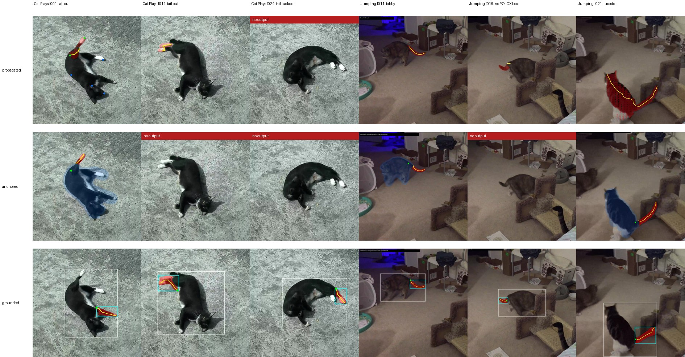

# Where, not whether: finding a cat's tail in ordinary video with a text-grounded detector

**Ava Kim** — cat-pose-benchmark, technical note v0.1, 14 September 2026

Repository: https://github.com/in-c0/cat-pose-benchmark · Code at commit `ccf9ff2` and later · Licence of this note: CC-BY-4.0

## Abstract

Existing animal pose models give a cat's tail two points, base and tip, and nothing in between. Earlier work in this repository showed that a generic segmenter (SAM2) can turn those two points into a continuous tail curve on a single frame, and that propagating the resulting mask through video is unreliable: on the first clip a person reviewed, the mask had drifted from the tail onto a hind leg within a second. This note compares three ways of getting a per-frame tail on 57 frames from two Creative Commons clips: mask propagation, a keypoint-anchored geometric method, and a text-grounded method that asks Grounding DINO for `"cat. tail."` and segments the returned box. The grounded method is the first of the three that behaves as if it knows what a tail is: on the clip where the tail is extended it is right on 14 of 15 frames, on both of two cats, including two frames where the YOLOX-m detector used elsewhere in the pipeline found no cat at all. Its failure is equally specific: when the tail is tucked under the body it draws a paw, because it has no way to answer "no tail visible". Three practical findings are reported along the way. A single phrase `"cat tail."` grounds the whole animal; two phrases are needed. A keypoint veto meant to remove paws removed six true tails and kept five paws, because the pose model is wrong on the same frames. Geometric rules applied to the grounded box raise precision and halve recall without separating the two classes. All counts here are one person's reading of contact sheets and are offered as a starting point for the repository's human-verdict protocol, not as its result.

## 1. What this note is about

The cat-pose-benchmark repository is building an open, licence-clean benchmark for feline pose from ordinary video. A bake-off in August 2026 found that existing animal pose models (RTMPose-m on AP-10K, SuperAnimal-Quadruped, FMPose3D) already recover gross body pose, paws and face points. Their shared gap is the parts that carry expression: ear geometry and the continuous tail curve. AP-10K has a single `tail_root` keypoint; SuperAnimal adds a tip; none gives the curve.

The repository's first answer was to combine what exists: take the two tail endpoints, prompt SAM2 with them, and skeletonise the mask into a curve. On a single frame this works. To get a curve per frame the mask was then propagated through video with SAM2's video predictor.

The human frame review that this repository set up in September 2026 was the first time a person looked at that output frame by frame. The verdict was immediate: on *Cat Plays*, the propagated mask sits on the tail for four frames and on the raised white hind paw for the next fifteen. SAM2 tracks the blob it was shown, and nothing in the loop knows what a tail is.

This note describes the two methods built in response and what they showed.

## 2. Material

Two clips from Wikimedia Commons, both licence-verified in the repository's manifests.

| clip | licence | length used | sampling | frames | subject |
|---|---|---|---|---|---|
| *Cat Plays* | CC-BY-SA-4.0 | 8.3 s | 4 fps | 33 | one tuxedo cat rolling on its back on concrete, portrait phone video; tail extended for about a third of the clip and tucked under the body for the rest |
| *Cat jumping backwards* | CC-BY-3.0 | first 8.0 s | 3 fps | 24 | two cats indoors, a grey tabby and a black-and-white tuxedo; the tuxedo jumps; motion blur on about a third of frames |

Sampling rates were chosen so that the existing SuperAnimal tail-seed fixtures land exactly on a sampled frame.

Body keypoints for every frame come from RTMPose-m (AP-10K, 17 points) via OpenMMLab's ONNX export, with YOLOX-m as detector, largest cat-or-dog box. The detector finds a cat on 26 of 33 and 17 of 24 frames; the misses are mostly motion blur.

Everything the models produce is S2 evidence in the repository's provenance scheme (model pseudo-label, no independent verification). The repository has a written human-verdict protocol for these frames: one row per frame and part, `ok` / `wrong` / `not_visible`, scored per method with disagreement retained. At the time of writing no human verdicts have been recorded. The counts in this note are the author's reading of the contact sheets and should be read as such.

## 3. Three methods

### 3.1 Propagated (baseline)

`detail/sam2_tail_video.py`. A SuperAnimal tail-base and tail-tip prediction on one frame, plus negative points on nose, neck, back and paws, seeds a SAM2 image mask. That mask is added to SAM2's video predictor and propagated forward and backward. The curve is the longest geodesic path of the mask skeleton, starting from the pixel nearest the base.

### 3.2 Anchored (geometry)

`detail/anchored_tail.py`. The first attempt was to re-seed SAM2 on every frame with `tail_root` as a positive prompt and every other keypoint as a negative. This does not work: with more than about four negative points SAM2's IoU head reports 0.0 for all candidates and the masks stay whole-cat. Adding a ring of probe positives around the root produced strips of the cat's back and speckled ground texture.

What works better is to ask SAM2 only for the whole cat (box prompt) and remove the body geometrically. A morphological opening with a disc of 0.045 × bbox diagonal keeps thick parts (trunk, head) and drops thin ones (tail, legs, ears). Leg tubes drawn along the RTMPose limb bones and a head polygon remove the thin parts that have keypoints. The connected piece of what remains that touches `tail_root` is the candidate. Rules reject it if it contains a limb or head keypoint, is speckle (fails a 3 px opening), exceeds 30 % of the bbox, has centreline elongation (length² / area) below 3, starts far from the root, or lies more than 35 % within a thin band around the body (a strip peeled off the back touches the body along its length; a tail touches it at the base).

### 3.3 Grounded (semantics)

`detail/grounded_tail.py`. Grounding DINO tiny (IDEA-Research, Apache-2.0, via `transformers`) is prompted on every frame. The cat box is the `cat` detection overlapping the body run's detection when there is one, otherwise the highest scoring. The tail box is the highest-scoring `tail` detection whose centre lies within the cat box and whose area is under half of it, threshold 0.2. SAM2 segments the tail box; the mask is clipped to the box; the curve is skeletonised as before, starting from `tail_root` when the body run has one and from the cat-box centre otherwise. No propagation and no geometric rules.

Two variants were built and left off by default; section 5 says why.

## 4. Results

Table 1 is the author's reading of the contact sheets in `review/results/2026-09-13-commons-v0/sheets/`. "Curve" is the number of frames on which the method produced output; "on the tail" is how many of those the author judged to be on the tail of the intended cat.

**Table 1.** Per-method output and eyeball correctness on the two clips.

| method | Cat Plays: curve / on tail | Jumping: curve / on tail | what the wrong ones are |
|---|---|---|---|
| propagated | 20 / 4 | 21 / ~12 | hind paw (15 frames); the other cat (3) |
| anchored | 7 / 3 | 6 / 4 | a strip of back or shadow (3); a blob beside the cat (1); a stub (1) |
| grounded | 33 / 11 | 15 / 14 | the white hind or front paw (20); white chest (1); a stub (1) |



**Figure 1.** Six frames, three methods. Rows: propagated, anchored, grounded. Columns, left to right: *Cat Plays* f001 (tail out), f012 (tail out), f024 (tail tucked); *Jumping* f011 (tabby), f016 (tabby, no YOLOX detection), f021 (tuxedo). Red is the accepted mask, yellow the curve, green the root. Blue in the anchored row is the subtracted body region; the cyan box in the grounded row is the detector's tail pick with the white box its cat pick. A red banner means the method produced nothing on that frame.

Three things in the table.

**The anchored method never claims a leg, and pays for it.** No accepted anchored output contains a limb keypoint, by construction, and the fifteen hind-paw frames of the propagated method are gone. Coverage is roughly half the propagated method's, and the remaining wrong frames are a new kind: a thin band of dark fur or shadow along the silhouette of a cat lying on its side, which the opening peels off the trunk and which then passes every rule.

**The grounded method finds an extended tail.** On the jumping clip, every frame where a cat was detected and a tail is out has the right tail, on both cats. On f016 and f017 YOLOX-m found no cat and the grounded method still found the tabby's tail, because Grounding DINO is also a better cat detector than YOLOX-m on this footage.

**The grounded method draws a paw when the tail is hidden.** *Cat Plays* has the tail tucked under the body for about two thirds of the clip. The detector has no "no tail" answer once it has a cat, so it returns the most tail-like thing in the box: a white paw, at scores 0.25–0.40. The right tails score 0.32–0.60. The two ranges overlap; f012 is right at 0.25 and f001 is wrong at 0.40, so a score threshold does not separate them.

## 5. Three findings worth recording

### 5.1 One phrase grounds the animal; two phrases ground the part

Prompted with `"cat tail."` as a single phrase, Grounding DINO returns the whole cat as the top box at 0.85 or above on every frame tried; the actual tail, when it appears at all, is a secondary box at 0.25–0.35. Prompted with `"cat. tail."` as two phrases, it returns separately labelled `cat` and `tail` boxes and the tail box is the right one on the frames where a tail is visible. The difference is a full stop. Anyone using a phrase-grounding detector for a part of an object should expect this and check their labels.

### 5.2 A veto from a second model trades one model's errors for another's

An obvious fix for the paw problem is to refuse any tail mask that contains a paw keypoint from the body run. On *Cat Plays* this removed six true tails and kept five paws. The cat is upside down for most of the clip; RTMPose puts paw keypoints on the tail and elsewhere on the same frames where the detector picks a paw. The two models fail together, so one cannot police the other. The veto is available behind a flag and off by default; the keypoints found inside each mask are recorded as diagnostics.

### 5.3 Geometry decides "whether" no better than the detector does

The anchored method's body-contact and elongation rules, applied to the grounded mask against a SAM2 cat mask, raise precision from 33 % to 50 % on *Cat Plays* and from 93 % to 100 % on the jumping clip, and lose six and four true tails respectively. The features do not separate the classes: right tails span body contact 0.0–0.93 and elongation 1.1–6.4, paws span 0.19–1.0 and 0–6.0. A paw tucked against the body and a tail curled against the flank look the same to these measures. A counter-prompt (`"cat. tail. leg. paw."`) does not separate them either; the detector returns merged labels such as `tail leg` on right and wrong frames alike.

So the state at the end of this note is that the detector decides *where* well and *whether* badly, and neither geometry nor a second prompt fixes *whether* on this footage.

## 6. What would move it

- **A "no tail visible" decision.** Two things are untested. Temporal consistency: a real tail box moves smoothly between frames, a paw picked by default jumps. And asking a vision-language model the question directly, per frame: "is this cat's tail visible?"
- **A stronger grounding model.** This note used the tiny Grounding DINO. SAM 3 accepts text concepts natively and tracks them in video; its licence terms need checking before it goes near the product path.
- **A trained tail-part head on a clean backbone.** The bake-off concluded this is the one learned component worth building. It needs labels, which the review protocol's correction mode is designed to produce.
- **Human verdicts.** Every number in this note is one person's reading of a contact sheet. The repository's review template has the rows; filling them is the next step, and it is the step that would tell whether the tallies above are honest.

## 7. Limitations

Two clips, two cats, one reviewer, no protocol verdicts. Thresholds (0.2 for tail boxes, 0.045 for the opening radius, 0.35 and 0.45 for body contact) were set by looking at these frames and have not been tried on held-out video. Runtime is about 0.45 s per frame for Grounding DINO on an RTX 2080 plus SAM2; fine for a benchmark, not for a device. The grounded method also inherits whatever biases the detector has about what a tail looks like; a white-tipped tail against dark fur may be easier than the general case.

## 8. Reproducing

At repository commit `ccf9ff2` or later, with `rtmlib`, `imageio-ffmpeg`, `transformers`, `sam2` (built with `SAM2_BUILD_CUDA=0`) and the usual torch/PIL/scikit-image/OpenCV stack:

```bash
python -m review.sample_frames
python -m review.run_body
python -m review.run_tail --device cuda
python -m review.run_tail_anchored --device cuda
python -m review.run_tail_grounded --device cuda
python -m review.sheets --output-dir review/work/sheets
python paper/make_figures.py
```

Model weights download on first run. The sheets, run summaries and the empty verdict template for this set are committed under `review/results/2026-09-13-commons-v0/`. The per-method reports with more detail are `detail/reports/anchored-tail-v0.md` and `detail/reports/grounded-tail-v0.md`.

## Acknowledgements

The experiments, code and first draft of this note were produced with Claude Code (Anthropic) working in the repository under the author's direction; the author reviewed the sheets that produced the "on the tail" counts and set the questions.

## References

- Liu, S. et al. *Grounding DINO: Marrying DINO with Grounded Pre-Training for Open-Set Object Detection.* ECCV 2024. Model: `IDEA-Research/grounding-dino-tiny`, Apache-2.0.
- Ravi, N. et al. *SAM 2: Segment Anything in Images and Videos.* 2024. Checkpoint `facebook/sam2.1-hiera-tiny`, Apache-2.0.
- Jiang, T. et al. *RTMPose: Real-Time Multi-Person Pose Estimation based on MMPose.* 2023. AP-10K checkpoint via OpenMMLab ONNX SDK.
- Yu, H. et al. *AP-10K: A Benchmark for Animal Pose Estimation in the Wild.* NeurIPS 2021 Datasets and Benchmarks.
- Ge, Z. et al. *YOLOX: Exceeding YOLO Series in 2021.* 2021.
- Ye, S. et al. *SuperAnimal pretrained pose estimation models for behavioral analysis.* Nature Communications 2024.
- Wikimedia Commons, *Cat Plays.webm* (Riverarvi, CC-BY-SA-4.0) and *Cat jumping backwards.webm* (Mary Qin, CC-BY-3.0).
